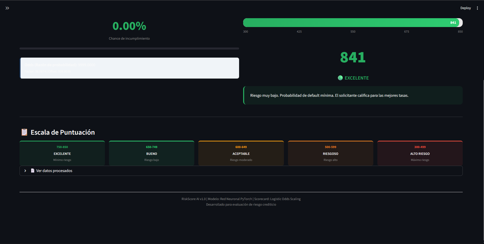

# RNA-Trabajo-2
# Predicción de Riesgo de Crédito con IA — LendingClub

Este proyecto desarrolla un sistema integral de evaluación crediticia utilizando técnicas avanzadas de **Machine Learning** y **Deep Learning**. A partir de los datos históricos de **LendingClub**, el sistema predice la probabilidad de incumplimiento (*default*) y la traduce a un puntaje financiero (*Score*) de fácil interpretación para la toma de decisiones bancarias.

## RiskScore AI: La Aplicación
El producto final es una herramienta interactiva construida en **Streamlit** que permite a analistas y usuarios evaluar perfiles crediticios en tiempo real, entregando un diagnóstico basado en un semáforo de riesgo.

---

## 📁 Estructura del Repositorio

```text
├── web.py                              # Código de la aplicación web (Streamlit)
├── 01_seleccion_caracteristicas.ipynb  # Limpieza del dataset y seleccion de caracteristicas
├── 02_regresion_logistica.ipynb        # Regresion logistica
├── 03_red_neuronal.ipynb               # Red neuronal
├── 04_scorecard.ipynb                  # Logica del Scorecard
├── 05_analisis_descriptivo.ipynb       # Graficas para el analisis descriptivo
├── scaler.pkl                          # Escalador de las variables
├── esquema_modelo.json                 # Contrato de columnas y tipos
├── credit_risk_nn.pth                  # Pesos de la red neuronal
├── requirements.txt                    # Dependencias del proyecto
└── README.md                           # Documentación principal
├── img/                                # Screenshots de la página
│   ├── img_1.png                       # Imagen 1
│   └── img_2.png                       # Imagen 2
```

## Instalación y Requisitos
1. Clonar el repositorio

`git clone [https://github.com/](https://github.com/)[JhanuarC]/[RNA-Trabajo-2].git
cd [RNA-Trabajo-2]`

2. Crear y activar un entorno virtual (opcional pero recomendado)

`python -m venv venv`

 En Windows:

`venv\Scripts\activate`
 
En Mac/Linux:

`source venv/bin/activate`

3. Instalar dependencias

`pip install -r requirements.txt`

## Uso de la aplicación

- Ejecutar el cuaderno `01_seleccion_caracteristicas.ipynb` para descagar y limpiar el dataset

- Ejecutar el cuaderno `03_red_neuronal.ipynb` para crear los archivos scaler.pkl y credit_risk_nn.pth en caso de estar corruptos

- Finalmente ejecutar la interfaz de RiskScore AI, se ejecuta el siguiente comando desde la raiz del proyecto:

    `streamlit run web.py`


## Funcionalidades de la App:

- Evaluación Instantánea: Ingreso de datos socioeconómicos y financieros.

- Pipeline Automático: Limpieza y transformación de datos en tiempo real.

- Semáforo de Riesgo: - 🟢 Verde (> 650): Riesgo bajo.

    - 🟡 Amarillo (500 - 600): Riesgo moderado.

    - 🔴 Rojo (< 500): Riesgo alto.

## Screenshot



## Contribuciones Individuales

| Autor | Contribución |
| ----------- | ----------- |
| Daniel Felipe Garzón Acosta | Análisis, limpiado y selección de características del dataset, Entrenamiento del modelo con regresión lineal y red neuronal
| Juan Felipe Moreno Ruiz | Entrenamiento del modelo con regresión lineal y red neuronal,Edición del video publicitario
| Jhanuar Castro Lopez| Realizado de la página web y la documentación |


## Recursos Adicionales
- [Video Promocional](https://www.example.com)
- [Documentación completa](https://www.example.com)

*Este proyecto fue desarrollado con fines académicos utilizando el dataset público de LendingClub.*


